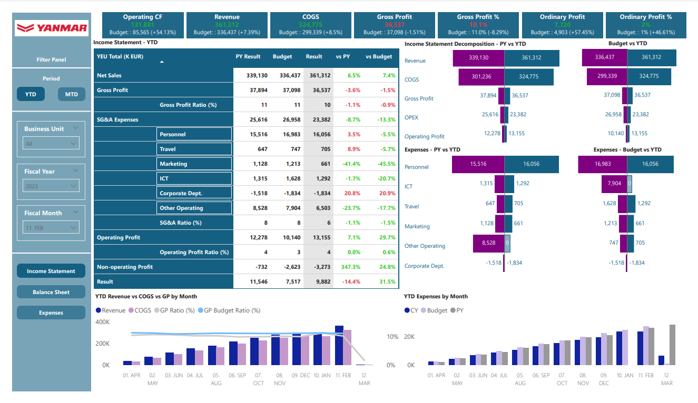
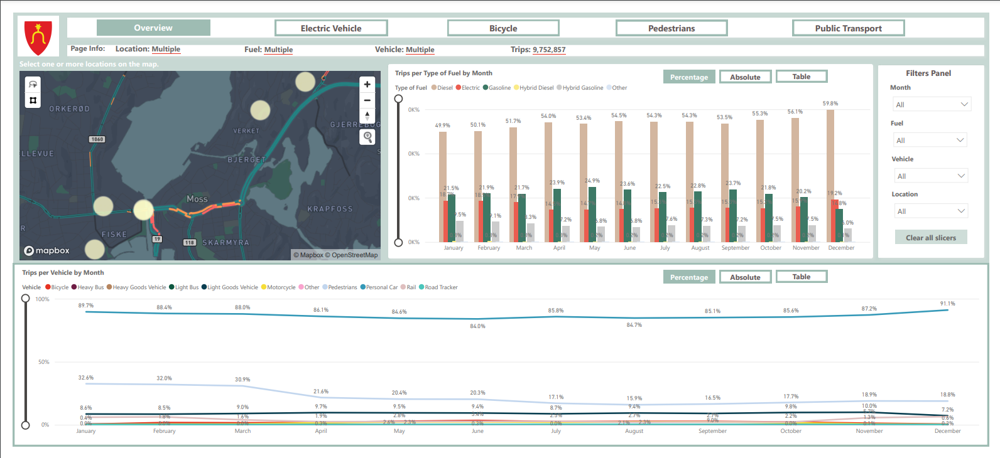
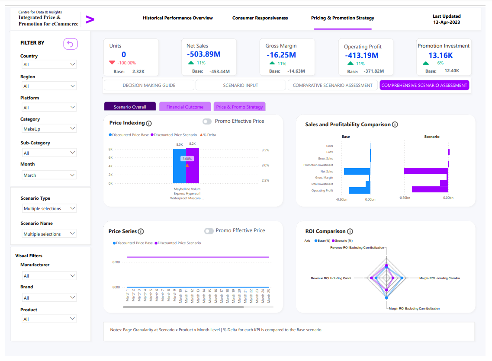

# Power BI Portfolio
Welcome to my Power BI Portfolio! Here you'll find a collection (small collection) of Power BI reports I've created, showcasing my data visualization, modelling, and analytical skills. Keep in mind that the numbers are not real for security and confidentiality reasons.

## Table of Contents
- [Financial Reports](#financial-reports)
- [Transportation Report](#transportation-report)
- [Ecom Mock Up](#ecom-mockup)

## Financial Reports
The dashboard provides insights into the consolidated financial reports of Yanmar Europe. Yanmar is a leader in machine manufacturing. Data have been pulled into Power BI by connecting to a company's online ShareFolder. ETL process has taken place in the Power BI workspace using M code.

- [Download the .pbix file](./Financial%20Reports.pbix)

## Transportation Report
The dashboard provides insights into the trips towards and outwards the municipality of Moss in Norway. The report aims to inform the stakeholders about the daily number of commuters related to the municipality and the transportation means used to apply effective urban solutions. 
Data sources: 
- Company's API
- Data sets from Telia
- Public API for daily temperature

- [Download the .pbix file](./Transportation%20Report.pbix)

## Predictive and Prescriptive Analytics Mock-up Dashboard for Ecom Company
The dashboard is a demo designed as a proof-of-concept for an e-commerce company.

- [Download the .pbix file](./Mock_Up_ecom.pbix)

## Contact
Feel free to reach out via [LinkedIn](https://www.linkedin.com/in/antonios-giakoumas/) or email me at antouantzakoum@gmail.com.
              
